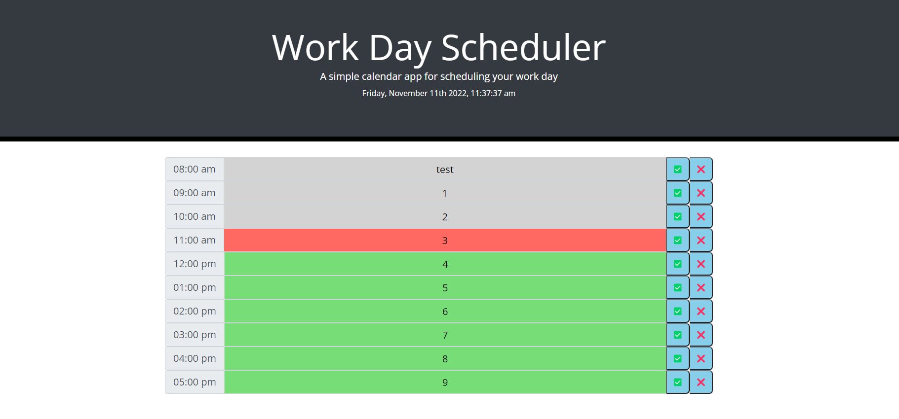

# Work-Day-Scheduler
## Description
This is a simple work day scheduler.
The purpose of this is to organize your day.
The application uses standard business hours.
This application allows the end user to store all of their things to do for that day in one place.

## Table of Contents (Optional)
N/A

## Installation
N/A

## Usage
Instructions on how to use:
There are 10 time blocks ranging from 8am-5pm
Each time block will be dynamically updated based on time of day.
If the time is in the past, the block will be grey
If the time is in the present, the block will be red
If the time is in the future, the block will be green.
To use, simply input your duties for that hour and select the green check.
To remove input, click the red x.

## Credits
Credit to our instructor, students in the class, TA's, tutor, and AskBCS.

## License

---

## Link to deployed site
https://hmustain.github.io/Work-Day-Scheduler/
